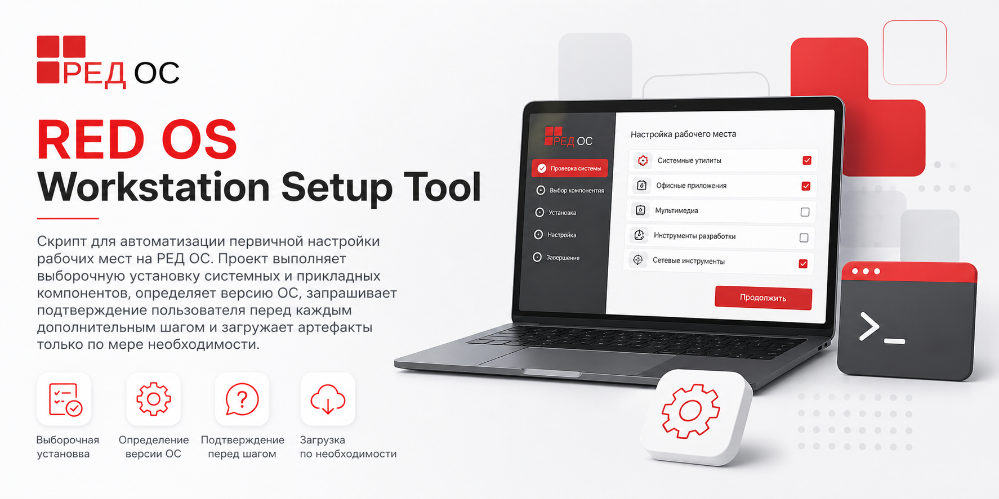

# RED OS Workstation Setup Tool

[](https://github.com/teanrus/redos-setup/releases)
[](LICENSE)
[](https://redos.red-soft.ru/)
[](https://github.com/teanrus/redos-setup/releases)
[](https://github.com/teanrus/redos-setup/stargazers)



## Обзор

Проект предназначен для сценариев, где требуется быстро подготовить рабочее место на РЕД ОС с повторяемой последовательностью действий:

- обновить систему и базовые репозитории;
- установить стандартный набор прикладного ПО;
- предложить дополнительные компоненты по выбору пользователя;
- выполнить отдельные системные настройки;
- не загружать лишние файлы, если пользователь не подтвердил установку соответствующего компонента.

Скрипт использует модель ленивой загрузки: файл скачивается из GitHub Releases только в момент установки и удаляется после завершения шага.

Проект включает два сценария запуска:

- `redos_workstation_setup_tool_cli.sh` - CLI-интерфейс для точечной установки компонентов и отдельных системных шагов;
- `redos_workstation_setup_tool.sh` - отдельный интерактивный сценарий подготовки рабочей станции с дополнительными системными настройками.

## Какой файл использовать

Используйте `redos_workstation_setup_tool_cli.sh`, если нужен управляемый интерфейс с командами и флагами: для точечной установки компонентов, отдельных системных шагов, `dry-run`, неинтерактивного запуска и автоматизации. Команда `interactive` в CLI покрывает сценарий, близкий по функциональности к `redos_workstation_setup_tool.sh`.

Используйте `redos_workstation_setup_tool.sh`, если нужен полностью интерактивный workstation-сценарий без работы через команды CLI: с настройкой часового пояса, `chrony`, автоматических обновлений, TRIM, KSG и базовых изменений SELinux.

## Возможности

- Определение версии ОС через `/etc/os-release`
- Поддержка выборочной установки компонентов
- Загрузка артефактов только по подтверждённым шагам
- Автоматическая очистка временных файлов из `/home/inst`
- Установка пакетов через `dnf` и vendor-архивы из GitHub Releases
- Проверка совместимости `ViPNet` с установленной версией РЕД ОС
- CLI-режим через `redos_workstation_setup_tool_cli.sh`
- CLI-команды для отдельных шагов workstation-настройки: обновление системы, ядра, времени, автообновлений и других системных действий
- Отдельный интерактивный workstation-сценарий через `redos_workstation_setup_tool.sh`
- Настройка времени и `chrony` с выбором часового пояса и NTP-серверов
- Настройка автоматических обновлений через `systemd timer`

## Совместимость

Поддержка версий РЕД ОС в текущем релизе:

| Версия ОС | Статус | Примечание |
| :-------- | :----- | :--------- |
| РЕД ОС 7.x | Полная поддержка | Доступен полный сценарий установки; `ViPNet` ставится из пакетов для РЕД ОС 7.x |
| РЕД ОС 8+ | Частичная поддержка | `ViPNet` ставится из пакетов для РЕД ОС 8+ |
| Другая Linux ОС | Не тестировалось | Скрипт предупредит, что ОС не распознана как РЕД ОС |

При запуске скрипт:

- определяет ОС и её основную версию;
- выводит информацию о найденной платформе;
- автоматически скрывает несовместимые шаги установки;
- продолжает предлагать остальные компоненты, если они не завязаны на ограниченные пакеты.

## Быстрый старт

Запуск напрямую из последнего релиза:

```bash
# CLI с командами и флагами
curl -sL https://github.com/teanrus/redos-setup/releases/latest/download/redos_workstation_setup_tool_cli.sh | sudo bash

# интерактивный workstation-сценарий
curl -sL https://github.com/teanrus/redos-setup/releases/latest/download/redos_workstation_setup_tool.sh | sudo bash
```

Запуск нового CLI из последнего релиза и проверка контрольной суммы:

```bash
curl -LO https://github.com/teanrus/redos-setup/releases/latest/download/redos_workstation_setup_tool_cli.sh
curl -LO https://github.com/teanrus/redos-setup/releases/latest/download/redos_workstation_setup_tool_cli.sh.sha256
sha256sum -c redos_workstation_setup_tool_cli.sh.sha256
chmod +x redos_workstation_setup_tool_cli.sh
sudo ./redos_workstation_setup_tool_cli.sh help
```

Запуск workstation tool из репозитория:

```bash
curl -LO https://github.com/teanrus/redos-setup/releases/latest/download/redos_workstation_setup_tool.sh
curl -LO https://github.com/teanrus/redos-setup/releases/latest/download/redos_workstation_setup_tool.sh.sha256
sha256sum -c redos_workstation_setup_tool.sh.sha256
chmod +x redos_workstation_setup_tool.sh
sudo ./redos_workstation_setup_tool.sh
```

## CLI

Файл `redos_workstation_setup_tool_cli.sh` предоставляет основной CLI-интерфейс проекта.

Поддерживаемые команды:

- `help` - показать справку;
- `version` - показать версию CLI;
- `check-os` - определить ОС и показать совместимость;
- `list` - вывести список компонентов и системных шагов;
- `install <component>` - установить конкретный компонент или отдельный шаг настройки;
- `remove <component>` - удалить установленный компонент или настройку, если поддерживается (alias: `uninstall`);
- `doctor` - выполнить базовую диагностику окружения;
- `interactive` - запустить workstation-сценарий, близкий по возможностям к `redos_workstation_setup_tool.sh`.

Поддерживаемые компоненты CLI:

- `base` - базовая подготовка системы: обновление системы и, на `РЕД ОС 7.x`, обновление ядра;
- `update-system` - обновить систему;
- `kernel` - обновить ядро через `redos-kernels6` на `РЕД ОС 7.x`;
- `yandex-browser` - установить Яндекс.Браузер;
- `r7-office` - установить R7 Office;
- `max` - установить MAX;
- `liberation-fonts` - установить шрифты Liberation;
- `chromium-gost` - установить Chromium-GOST;
- `sreda` - установить Среда;
- `vk-messenger` - установить VK Messenger;
- `telegram` - установить Telegram;
- `messengers` - установить группу мессенджеров;
- `kaspersky` - установить Kaspersky Agent;
- `vipnet` - установить ViPNet;
- `1c` - установить 1С:Предприятие;
- `trim` - включить `fstrim.timer`;
- `grub` - пересобрать `grub.cfg`;
- `ksg` - применить настройку для моноблока KSG;
- `timedate` - настроить часовой пояс и `chrony`;
- `auto-update` - настроить автоматическое обновление через `systemd timer`;
- `all` - выполнить все совместимые компоненты и шаги.

Список компонентов, поддерживающих автоматическое удаление:

- `yandex-browser`
- `r7-office`
- `max`
- `liberation-fonts`
- `chromium-gost`
- `sreda`
- `vk-messenger`
- `telegram`
- `messengers`
- `kaspersky`
- `vipnet`
- `1c`
- `trim`
- `ksg`
- `timedate`
- `auto-update`
- `all`

### Примеры использования CLI

Показать справку:

```bash
sudo ./redos_workstation_setup_tool_cli.sh help
```

Показать версию CLI:

```bash
sudo ./redos_workstation_setup_tool_cli.sh version
```

Проверить определение ОС и совместимость:

```bash
sudo ./redos_workstation_setup_tool_cli.sh check-os
```

Показать все компоненты:

```bash
sudo ./redos_workstation_setup_tool_cli.sh list
```

Показать только совместимые компоненты:

```bash
sudo ./redos_workstation_setup_tool_cli.sh list --compatible
```

Установить базовую систему:

```bash
sudo ./redos_workstation_setup_tool_cli.sh install base
```

Обновить систему отдельной командой:

```bash
sudo ./redos_workstation_setup_tool_cli.sh install update-system
```

Обновить ядро на `РЕД ОС 7.x`:

```bash
sudo ./redos_workstation_setup_tool_cli.sh install kernel
```

Установить Яндекс.Браузер:

```bash
sudo ./redos_workstation_setup_tool_cli.sh install yandex-browser
```

Установить R7 Office:

```bash
sudo ./redos_workstation_setup_tool_cli.sh install r7-office
```

Установить MAX:

```bash
sudo ./redos_workstation_setup_tool_cli.sh install max
```

Установить Chromium-GOST:

```bash
sudo ./redos_workstation_setup_tool_cli.sh install chromium-gost
```

Установить ViPNet Client:

```bash
sudo ./redos_workstation_setup_tool_cli.sh install vipnet --variant client
```

Установить ViPNet + Деловая почта:

```bash
sudo ./redos_workstation_setup_tool_cli.sh install vipnet --variant dp
```

Установить все совместимые компоненты без подтверждений:

```bash
sudo ./redos_workstation_setup_tool_cli.sh --yes install all
```

Показать план действий без изменений:

```bash
sudo ./redos_workstation_setup_tool_cli.sh --dry-run install base
```

Настроить время и `chrony`:

```bash
sudo ./redos_workstation_setup_tool_cli.sh install timedate
```

Настроить автоматические обновления:

```bash
sudo ./redos_workstation_setup_tool_cli.sh install auto-update
```

Запустить диагностику:

```bash
sudo ./redos_workstation_setup_tool_cli.sh doctor
```

Удалить установленный компонент:

```bash
sudo ./redos_workstation_setup_tool_cli.sh remove vipnet
```

Запустить интерактивный workstation-режим:

```bash
sudo ./redos_workstation_setup_tool_cli.sh interactive
```

### Глобальные флаги CLI

| Флаг | Назначение |
| :--- | :--------- |
| `-y`, `--yes` | Не задавать вопросы подтверждения |
| `--dry-run` | Только показать план действий без изменений |
| `--verbose` | Включить подробный вывод |
| `--workdir PATH` | Переопределить рабочую директорию |
| `--variant VALUE` | Выбрать вариант установки, например для `vipnet` |
| `--no-color` | Отключить цветной вывод |
| `--json` | JSON-вывод для `check-os` |

## Workstation Tool

Файл `redos_workstation_setup_tool.sh` предназначен для интерактивной подготовки рабочей станции РЕД ОС. Он охватывает не только установку ПО, но и эксплуатационные настройки, которые обычно выполняются после развёртывания системы. В отличие от `redos_workstation_setup_tool_cli.sh`, этот сценарий не требует отдельных команд и ведёт пользователя по шагам в полностью интерактивном режиме.

Что умеет сценарий:

- обновлять систему и, для РЕД ОС 7.x, предлагать обновление ядра через `redos-kernels6`;
- устанавливать прикладное ПО: Яндекс.Браузер, R7 Office, MAX, Среда, Chromium-GOST, Liberation Fonts, Kaspersky Agent, ViPNet, 1С;
- настраивать TRIM для SSD и конфигурацию моноблока KSG;
- управлять режимом SELinux в интерактивном режиме;
- настраивать время: выбор часового пояса, отключение встроенного NTP, установка и конфигурация `chrony`, ожидание синхронизации;
- настраивать автоматические обновления через `redos-auto-update`, `systemd service` и `systemd timer`;
- предлагать перезагрузку после завершения настройки.

Пример запуска:

```bash
sudo ./redos_workstation_setup_tool.sh
```

Минимальные зависимости, указанные в самом сценарии:

- `bash`, `dnf`, `curl`, `wget`, `coreutils`;
- опционально: `unzip`, `rpm`, `tar`.

## Требования

| Параметр | Значение |
| :------- | :------- |
| ОС | РЕД ОС 7.x или 8+ |
| Права | `root` / `sudo` |
| Интернет | Требуется для загрузки файлов из GitHub Releases |
| RAM | Минимум 2 GB, рекомендуется 4 GB |
| Диск | Не менее 5 GB свободного места |
| Архитектура | `x86_64` |

Совместимость компонентов:

- `РЕД ОС 7.x`: полный сценарий установки
- `РЕД ОС 8+`: `ViPNet` устанавливается из отдельных пакетов для 8+

## Как это работает

Сценарий работы одинаков для базовых и дополнительных компонентов:

1. Скрипт проверяет запуск от `root`.
2. Определяет версию ОС и выводит информацию о совместимости.
3. Проверяет состояние SELinux и предлагает изменить режим перед установкой.
4. Создаёт рабочую директорию `/home/inst`.
5. Запрашивает подтверждение перед каждым шагом установки.
6. Поочерёдно предлагает компоненты и выполняет установку только для выбранных.
7. Скачивает только подтверждённые артефакты и очищает временные файлы после шага.
8. Предлагает системные настройки: TRIM, KSG, синхронизацию времени и автоматические обновления.
9. Предлагает перезагрузить систему после завершения.

Пример выбора `ViPNet` на совместимой системе:

```text
Установить ViPNet? (y/n): y
=== Выбор версии ViPNet ===
1. ViPNet Client (без деловой почты)
2. ViPNet + Деловая почта (DP)
Выберите вариант (1 или 2): 1
Загрузка vipnetclient-gui_gost_ru_x86-64_4.15.0-26717.rpm...
✓ Установка ViPNet Client успешно выполнено
```


Пример поведения на РЕД ОС 8+:

```text
=== Начало настройки РЕД ОС ===
Обнаружена ОС: РЕД ОС 8.0
Основная версия РЕД ОС: 8
Внимание: скрипт изначально разрабатывался и тестировался для РЕД ОС 7.3.
Для РЕД ОС 8.0 ViPNet будет устанавливаться из пакетов для РЕД ОС 8+.
Остальные компоненты будут предложены к установке как обычно.
```

## Что устанавливается

### Основные компоненты

| Компонент | Описание |
| :-------- | :------- |
| Обновление системы | Полное обновление пакетов через `dnf update` |
| Ядро `redos-kernels6` | Опциональное обновление ядра для `РЕД ОС 7.x` |
| Яндекс.Браузер | Установка `yandex-browser-stable` из репозитория Яндекса |
| R7 Office | Установка пакета `r7-office` |
| MAX Desktop | Установка приложения `max` с добавлением репозитория |
| СРЕДА | Установка корпоративного мессенджера `sreda` |
| Chromium-GOST | Установка браузера `chromium-gost-stable` |
| Kaspersky Agent | Установка агента из архива `kasp.tar.gz` |
| ViPNet | Установка ViPNet Client или ViPNet + Деловая почта |
| 1С:Предприятие | Установка платформы `1С:Предприятие` из архива `1c.tar.gz` |
| Шрифты Liberation | Установка шрифтов из архива `Liberation.zip` |

## Изменения в системе

Сценарии `redos_workstation_setup_tool_cli.sh` и `redos_workstation_setup_tool.sh` вносят изменения в систему. Конкретный набор изменений зависит от выбранного сценария и подтверждённых шагов. Перед запуском стоит учитывать следующие действия:

- обновляет пакеты через `dnf`;
- спрашивает пользователя о настройке SELinux (см. раздел [Управление SELinux](#управление-selinux));
- создаёт рабочую директорию `/home/inst`;
- добавляет репозитории и устанавливает сторонние пакеты;
- может обновить конфигурацию GRUB;
- может включить `fstrim.timer`;
- может добавить `xrandr --output HDMI-3 --primary` в `/etc/gdm/Init/Default`.

Для `redos_workstation_setup_tool_cli.sh` эти изменения выполняются только при запуске соответствующих команд или через `interactive`. В `redos_workstation_setup_tool.sh` те же шаги доступны в полностью интерактивном режиме.

### Дополнительные системные настройки

| Настройка | Описание |
| :-------- | :------- |
| TRIM для SSD | Включение `fstrim.timer` |
| Обновление GRUB | Пересоздание `/boot/grub2/grub.cfg` |
| Моноблок KSG | Добавление `xrandr --output HDMI-3 --primary` перед `exit 0` в `/etc/gdm/Init/Default` |

## Управление SELinux

Скрипт предоставляет безопасное управление SELinux вместо автоматического отключения:

### Если SELinux в режиме enforcing

Если обнаружен SELinux в режиме `enforcing`, скрипт предлагает три варианта:

1. **Оставить SELinux в режиме enforcing** (самый безопасный)
   - Скрипт выводит справку по управлению SELinux правилами
   - Рекомендуется использовать `semanage` и `audit2allow` для добавления необходимых правил
   - При необходимости можно просмотреть логи нарушений в `/var/log/audit/audit.log`

2. **Перевести SELinux в режим permissive** (рекомендуется)
   - SELinux логирует нарушения, но не блокирует приложения
   - Позволяет проверить совместимость без полного отключения
   - После выбора требуется перезагрузка для применения изменений

3. **Отключить SELinux (disabled)** (не рекомендуется)
   - Полное отключение защиты
   - Требуется перезагрузка для применения
   - Используется только для совместимости со старыми конфигурациями

### Если SELinux отключен (disabled)

Если SELinux в настоящее время отключен, скрипт предлагает его включить для повышения безопасности:

1. **Включить SELinux в режиме enforcing** (самый безопасный, рекомендуется)
   - SELinux будет активирован и блокировать нарушения
   - Требуется перезагрузка для применения
   - После включения рекомендуется использовать `semanage` для добавления правил

2. **Включить SELinux в режиме permissive** (рекомендуется для начинающих)
   - SELinux будет активирован в режиме логирования
   - Логирует нарушения, но не блокирует приложения
   - Позволяет проверить совместимость перед переходом в enforcing
   - Требуется перезагрузка для применения

3. **Оставить SELinux отключенным** (не рекомендуется)
   - SELinux остаётся в режиме disabled
   - Система не получает защиту SELinux

### В неинтерактивном режиме (флаг --yes)

При запуске с флагом `--yes`:

- Если SELinux в режиме enforcing: скрипт выбирает режим **permissive**
- Если SELinux в режиме disabled: скрипт оставляет его отключенным

### Автоматическое добавление SELinux правил для приложений

Скрипт автоматически добавляет SELinux политики для установленных приложений:

- **Отслеживание установки**: Когда приложение устанавливается в `/opt` (например, Telegram, 1С), скрипт запоминает путь установки
- **Добавление контекстов**: После установки всех компонентов скрипт автоматически добавляет необходимые SELinux контексты через `semanage`
- **Применение политик**: Используется `restorecon` для применения новых контекстов к файлам
- **Анализ нарушений**: Если доступен `audit2allow`, скрипт анализирует логи и создает дополнительные политики на основе обнаруженных нарушений

Это позволяет системе оставаться в безопасном режиме `enforcing` или `permissive`, автоматически адаптируясь к установленным приложениям.

### Справка по SELinux правилам

Если при установке приложений появляются ошибки SELinux, используйте:

```bash
# Просмотр логов нарушений
sudo tail -f /var/log/audit/audit.log

# Анализ нарушений
sudo sealert -l "*"

# Автоматическое создание и применение правил
sudo audit2allow -a -M app_policy
sudo semodule -i app_policy.pp

# Добавление правила для конкретного сценария
sudo semanage fcontext -a -t user_home_t "/opt/app(/.*)?"
sudo restorecon -Rv /opt/app
```

## Особенности отдельных компонентов

Telegram:

- Распаковывается в `/opt/telegram`
- Создаётся символическая ссылка `/usr/bin/telegram`
- Добавляется ярлык в меню приложений

Шрифты Liberation:

- Устанавливаются в `/usr/share/fonts/liberation`
- После установки выполняется `fc-cache -fv`

ViPNet:

- На `РЕД ОС 7.x` Client-версия устанавливается из `vipnetclient-gui_gost_ru_x86-64_4.15.0-26717.rpm`
- На `РЕД ОС 7.x` DP-версия устанавливается из архива `VipNet-DP.tar.gz`
- На `РЕД ОС 8+` Client-версия устанавливается из `vipnetclient-gui_gost_x86-64_5.1.3-8402.rpm`
- На `РЕД ОС 8+` DP-версия устанавливает `vipnetclient-gui_gost_x86-64_5.1.3-8402.rpm` и `vipnetbusinessmail_ru_x86-64_1.4.2-5248.rpm`

## Оценка загрузки

Оценка объёма загрузки зависит от выбранного сценария:

| Сценарий | Скачанные файлы | Экономия трафика |
| :------- | :-------------- | :--------------- |
| Установка всего ПО | ~2.8 GB | 0% |
| Только базовая система | ~1.5 GB | 46% |
| Базовая + мессенджеры | ~1.8 GB | 36% |
| Только 1С | ~1.2 GB | 57% |

## Обозначения вывода

| Цвет | Значение |
| :--- | :------- |
| Зелёный | Успешное выполнение операции |
| Красный | Ошибка |
| Жёлтый | Запрос подтверждения или предупреждение |
| Синий | Информационное сообщение |

## Документация проекта

- [README.md](README.md) - обзор проекта, совместимость, установка и описание поведения сценариев
- [redos_workstation_setup_tool_cli.sh](redos_workstation_setup_tool_cli.sh) - CLI-сценарий для точечной установки компонентов и системных шагов
- [redos_workstation_setup_tool.sh](redos_workstation_setup_tool.sh) - интерактивный сценарий подготовки рабочей станции
- [CONTRIBUTING.md](CONTRIBUTING.md) - правила и рекомендации для изменений в репозитории
- [CHANGELOG.md](CHANGELOG.md) - заметные изменения по релизам и в `Unreleased`
- [SECURITY.md](SECURITY.md) - краткая политика по поддерживаемым версиям и сообщениям об уязвимостях

## Безопасность и эксплуатационные замечания

- Скрипт запускается с правами `root`.
- Артефакты загружаются из GitHub Releases этого репозитория.
- Для коммерческих продуктов требуются действующие лицензии.
- Перед запуском рекомендуется резервное копирование важных данных.
- Для РЕД ОС 8+ `ViPNet` уже ставится из отдельных пакетов релиза `packages`.

## Лицензия

Проект распространяется по лицензии MIT. Подробности приведены в файле [LICENSE](LICENSE).

Copyright (c) 2025 teanrus

## Поддержка

- Релизы: <https://github.com/teanrus/redos-setup/releases>
- Исходный код: <https://github.com/teanrus/redos-setup>
- Контакт: [tyanrv@lbt.yanao.ru](mailto:tyanrv@lbt.yanao.ru)
